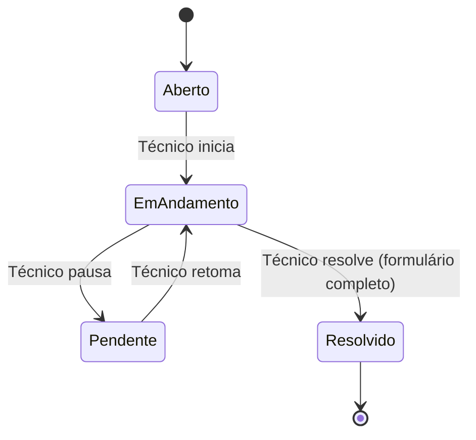

# Sistema Completo de Gerenciamento de Chamados
**NetoNerd ITSM - Documentação Técnica**

**Data:** 2026-01-21
**Versão:** 2.0

---

## 📋 Índice

1. [Visão Geral](#visão-geral)
2. [Fluxo de Trabalho](#fluxo-de-trabalho)
3. [Estrutura do Banco de Dados](#estrutura-do-banco-de-dados)
4. [Funcionalidades por Perfil](#funcionalidades-por-perfil)
5. [Instalação e Configuração](#instalação-e-configuração)
6. [APIs e Endpoints](#apis-e-endpoints)
7. [Regras de Negócio](#regras-de-negócio)
8. [Troubleshooting](#troubleshooting)

---

## 🎯 Visão Geral

### O que foi implementado?

Sistema completo de gerenciamento de chamados técnicos com:

✅ **Atribuição de chamados** por administradores
✅ **Gerenciamento de status** (aberto → em andamento → resolvido)
✅ **Histórico detalhado** de atendimento obrigatório
✅ **Upload de fotos** do serviço realizado
✅ **Identificação de serviços** StyleManager (software - não cobra)
✅ **Controle de pagamento** com múltiplas formas
✅ **Cálculo automático** de tempo de atendimento
✅ **Logs e auditoria** completos

### Perfis de Usuário

| Perfil | Permissões |
|--------|------------|
| **Admin** | Atribuir chamados, visualizar todos chamados, relatórios, gerenciar técnicos |
| **Técnico** | Ver chamados atribuídos, iniciar/pausar atendimento, resolver chamados |
| **Cliente** | Abrir chamados, ver status, adicionar comentários |

---

## 🔄 Fluxo de Trabalho

### Ciclo de Vida de um Chamado

```
┌─────────────────────────────────────────────────────────────────┐
│ 1. ABERTURA (Cliente)                                          │
│    • Cliente abre chamado via sistema                          │
│    • Status inicial: "aberto"                                  │
│    • Técnico: NULL (não atribuído)                             │
└─────────────────────────────────────────────────────────────────┘
                            ↓
┌─────────────────────────────────────────────────────────────────┐
│ 2. ATRIBUIÇÃO (Admin)                                          │
│    • Admin visualiza chamados não atribuídos                   │
│    • Seleciona técnico disponível                              │
│    • Sistema registra atribuição no histórico                  │
│    • Técnico recebe notificação                                │
└─────────────────────────────────────────────────────────────────┘
                            ↓
┌─────────────────────────────────────────────────────────────────┐
│ 3. INÍCIO DO ATENDIMENTO (Técnico)                             │
│    • Técnico clica em "Iniciar Atendimento"                    │
│    • Status: "aberto" → "em andamento"                         │
│    • data_inicio_atendimento = NOW()                           │
│    • Timer de atendimento inicia                               │
└─────────────────────────────────────────────────────────────────┘
                            ↓
┌─────────────────────────────────────────────────────────────────┐
│ 4. ATENDIMENTO (Técnico)                                        │
│    • Técnico pode adicionar atualizações:                      │
│      - Comentários                                             │
│      - Necessita peça (muda para "pendente")                  │
│      - Aguardando cliente (muda para "pendente")              │
│    • Pode pausar/retomar atendimento                           │
└─────────────────────────────────────────────────────────────────┘
                            ↓
┌─────────────────────────────────────────────────────────────────┐
│ 5. RESOLUÇÃO (Técnico) - OBRIGATÓRIOS:                        │
│    ✓ Histórico detalhado (mínimo 50 caracteres)              │
│    ✓ Checkbox: StyleManager Software? (sim/não)              │
│    ✓ Forma de pagamento (se não for StyleManager)            │
│    ✓ Pelo menos 1 foto do serviço                            │
└─────────────────────────────────────────────────────────────────┘
                            ↓
┌─────────────────────────────────────────────────────────────────┐
│ 6. FINALIZAÇÃO                                                  │
│    • Status: "em andamento" → "resolvido"                      │
│    • data_resolucao = NOW()                                    │
│    • tempo_atendimento_minutos calculado automaticamente       │
│    • Fotos salvas em /uploads/chamados/{id}/                  │
│    • Logs registrados                                          │
└─────────────────────────────────────────────────────────────────┘
```

---

## 🗄️ Estrutura do Banco de Dados

### Migração Executada

**Arquivo:** `config/bandoDeDados/migracao_sistema_chamados.sql`

**Executar com:**
```bash
mysql -u root -p netonerd_chamados < config/bandoDeDados/migracao_sistema_chamados.sql
```

### Novas Tabelas Criadas

#### 1. `chamado_fotos`
Armazena fotos dos serviços realizados (múltiplas fotos por chamado).

```sql
CREATE TABLE `chamado_fotos` (
  `id` INT(11) NOT NULL AUTO_INCREMENT,
  `chamado_id` INT(11) NOT NULL,
  `tecnico_id` INT(11) NOT NULL,
  `nome_arquivo` VARCHAR(255) NOT NULL,
  `caminho_arquivo` VARCHAR(500) NOT NULL,
  `descricao` VARCHAR(255) NULL,
  `data_upload` TIMESTAMP NOT NULL DEFAULT CURRENT_TIMESTAMP,
  PRIMARY KEY (`id`),
  FOREIGN KEY (`chamado_id`) REFERENCES `chamados`(`id`) ON DELETE CASCADE
);
```

**Exemplo de uso:**
```php
// Buscar fotos de um chamado
SELECT * FROM chamado_fotos WHERE chamado_id = 123;
```

#### 2. `chamado_atribuicoes`
Histórico completo de quem atribuiu o chamado para quem.

```sql
CREATE TABLE `chamado_atribuicoes` (
  `id` INT(11) NOT NULL AUTO_INCREMENT,
  `chamado_id` INT(11) NOT NULL,
  `tecnico_id` INT(11) NOT NULL,
  `admin_id` INT(11) NOT NULL COMMENT 'Admin que fez a atribuição',
  `data_atribuicao` TIMESTAMP NOT NULL DEFAULT CURRENT_TIMESTAMP,
  `comentario` TEXT NULL,
  `ativo` TINYINT(1) DEFAULT 1 COMMENT '1=Atribuição ativa, 0=Técnico foi removido',
  PRIMARY KEY (`id`)
);
```

**Exemplo de uso:**
```php
// Ver histórico de atribuições de um chamado
SELECT
    ca.*,
    t.nome as tecnico_nome,
    a.nome as admin_nome
FROM chamado_atribuicoes ca
JOIN tecnicos t ON ca.tecnico_id = t.id
JOIN tecnicos a ON ca.admin_id = a.id
WHERE ca.chamado_id = 123
ORDER BY ca.data_atribuicao DESC;
```

#### 3. `chamado_atualizacoes`
Todas as atualizações e comentários do técnico durante o atendimento.

```sql
CREATE TABLE `chamado_atualizacoes` (
  `id` INT(11) NOT NULL AUTO_INCREMENT,
  `chamado_id` INT(11) NOT NULL,
  `tecnico_id` INT(11) NOT NULL,
  `tipo_atualizacao` ENUM('comentario','inicio_atendimento','pausa','conclusao','necessita_peca','aguardando_cliente') NOT NULL,
  `descricao` TEXT NOT NULL,
  `data_atualizacao` TIMESTAMP NOT NULL DEFAULT CURRENT_TIMESTAMP,
  PRIMARY KEY (`id`)
);
```

**Tipos de atualização:**
- `comentario`: Comentário geral do técnico
- `inicio_atendimento`: Quando técnico inicia
- `pausa`: Quando técnico pausa
- `conclusao`: Quando resolve o chamado
- `necessita_peca`: Aguardando peça
- `aguardando_cliente`: Aguardando resposta do cliente

### Novos Campos na Tabela `chamados`

```sql
ALTER TABLE `chamados`
ADD COLUMN `historico_atendimento` TEXT NULL,
ADD COLUMN `stylemanager_software` TINYINT(1) DEFAULT 0,
ADD COLUMN `data_inicio_atendimento` TIMESTAMP NULL,
ADD COLUMN `data_resolucao` TIMESTAMP NULL,
ADD COLUMN `tempo_atendimento_minutos` INT NULL;

-- Ajustar pagamento_forma para permitir NULL
ALTER TABLE `chamados`
MODIFY COLUMN `pagamento_forma` ENUM('Cartão','Débito','PIX','Dinheiro') NULL;
```

### Views Criadas

#### `view_chamados_completos`
Todos os dados do chamado em uma única query.

```sql
SELECT * FROM view_chamados_completos WHERE id = 123;
-- Retorna: dados do chamado + cliente + técnico + contadores + status pagamento
```

#### `view_chamados_por_tecnico`
Estatísticas de chamados por técnico.

```sql
SELECT * FROM view_chamados_por_tecnico ORDER BY chamados_em_andamento DESC;
-- Retorna: nome técnico, total abertos, em andamento, resolvidos, tempo médio
```

#### `view_chamados_nao_atribuidos`
Lista de chamados aguardando atribuição.

```sql
SELECT * FROM view_chamados_nao_atribuidos ORDER BY prioridade DESC;
-- Usado pela página admin/atribuir_chamados.php
```

### Triggers

#### `calcular_tempo_atendimento`
Calcula automaticamente o tempo de atendimento quando chamado é resolvido.

```sql
-- Executado automaticamente em UPDATE de chamados
-- Calcula: data_resolucao - data_inicio_atendimento = tempo_atendimento_minutos
```

### Stored Procedures

#### `sp_atribuir_chamado`
Atribui chamado a técnico (uso admin).

```sql
CALL sp_atribuir_chamado(
    123,    -- chamado_id
    5,      -- tecnico_id
    1,      -- admin_id
    'Cliente relata urgência' -- comentario
);
```

#### `sp_iniciar_atendimento`
Inicia atendimento (uso técnico).

```sql
CALL sp_iniciar_atendimento(123, 5); -- chamado_id, tecnico_id
```

---

## 👥 Funcionalidades por Perfil

### ADMINISTRADOR

#### Página: `admin/atribuir_chamados.php`

**Recursos:**
- ✅ Ver todos os chamados não atribuídos (destaque)
- ✅ Ver estatísticas de carga de trabalho por técnico
- ✅ Atribuir chamado a técnico disponível
- ✅ Reatribuir chamado para outro técnico
- ✅ Adicionar comentário na atribuição
- ✅ Filtros por status, prioridade e busca

**Acesso:** Apenas admins (matrícula com ADM ou padrão A###)

**Screenshots das funcionalidades:**
- Card de chamado com informações completas
- Modal de atribuição mostrando técnicos disponíveis
- Badge de horas aguardando (alerta após 24h)
- Estatísticas de cada técnico (abertos, em andamento, pendentes)

**Validações:**
- ❌ Não pode atribuir para administradores
- ❌ Não pode atribuir para técnicos inativos
- ✅ Histórico completo de atribuições

---

### TÉCNICO

#### Página: `tecnico/meus_chamados.php`

**Recursos:**
- ✅ Ver todos os chamados atribuídos
- ✅ Dashboard com estatísticas pessoais
- ✅ Iniciar atendimento (aberto → em andamento)
- ✅ Pausar atendimento (em andamento → pendente)
- ✅ Retomar atendimento (pendente → em andamento)
- ✅ Adicionar atualizações
- ✅ Resolver chamado (formulário completo)
- ✅ Ver tempo de atendimento em tempo real
- ✅ Filtros por status e prioridade

**Acesso:** Técnicos e admins

**Cards de Estatísticas:**
```
┌──────────┬──────────────┬───────────┬────────────┐
│ Abertos  │ Em Andamento │ Pendentes │ Resolvidos │
│    5     │      3       │     2     │     45     │
└──────────┴──────────────┴───────────┴────────────┘
```

#### Página: `tecnico/resolver_chamado.php`

**Recursos:**
- ✅ Formulário completo de resolução
- ✅ Visualização de todas as informações do chamado
- ✅ Histórico de atualizações anteriores

**Campos Obrigatórios:**

1. **Histórico do Atendimento**
   - Textarea com mínimo 50 caracteres
   - Validação no frontend e backend
   - Exemplo fornecido no placeholder

2. **Checkbox: StyleManager Software**
   - Se marcado: não cobra o cliente
   - Se desmarcado: obrigatório informar pagamento
   - Info box explicativo aparece quando marcado

3. **Forma de Pagamento** (condicional)
   - Obrigatório se NÃO for StyleManager Software
   - Opções: PIX, Dinheiro, Cartão, Débito
   - Desabilitado automaticamente se StyleManager marcado

4. **Fotos do Serviço**
   - Mínimo: 1 foto
   - Máximo por foto: 5MB
   - Formatos: JPG, PNG, GIF
   - Preview automático das imagens
   - Upload múltiplo suportado

**Validações JavaScript:**
```javascript
// Antes de enviar:
- Histórico >= 50 caracteres
- Se StyleManager=false → pagamento obrigatório
- Fotos > 0
- Confirmação final
```

**Validações PHP:**
```php
// processar_resolucao.php:
- Verificar se chamado pertence ao técnico
- Validar todos os campos obrigatórios
- Validar tamanho e tipo de arquivo
- Processar upload com segurança
- Transação atômica (rollback em erro)
```

---

### CLIENTE

#### Funcionalidades Existentes

- Abrir novos chamados
- Ver status de seus chamados
- Adicionar comentários
- Fechar chamados resolvidos

*(Sem alterações nesta versão)*

---

## 🚀 Instalação e Configuração

### Passo 1: Executar Migração do Banco

```bash
cd /home/user/New_NetoNerd

# Backup do banco atual (recomendado)
mysqldump -u root -p netonerd_chamados > backup_$(date +%Y%m%d).sql

# Executar migração
mysql -u root -p netonerd_chamados < config/bandoDeDados/migracao_sistema_chamados.sql
```

**O que a migração faz:**
1. ✅ Cria backup automático (tabela `chamados_backup_20260121`)
2. ✅ Adiciona novos campos na tabela `chamados`
3. ✅ Cria 3 novas tabelas (fotos, atribuições, atualizações)
4. ✅ Cria 3 views úteis
5. ✅ Cria trigger de cálculo de tempo
6. ✅ Cria 2 stored procedures
7. ✅ Adiciona índices para performance
8. ✅ Exibe relatório final

### Passo 2: Criar Diretório de Uploads

```bash
mkdir -p uploads/chamados
chmod 755 uploads/chamados
chown www-data:www-data uploads/chamados
```

**Estrutura de diretórios:**
```
uploads/
└── chamados/
    ├── 123/
    │   ├── foto_1642851234_abc123.jpg
    │   └── foto_1642851235_def456.jpg
    ├── 124/
    │   └── foto_1642851300_ghi789.jpg
    └── .gitignore
```

**Criar `.gitignore` em uploads/:**
```
*
!.gitignore
```

### Passo 3: Verificar Permissões

```bash
# Verificar se admin pode acessar
# Login com: matrícula 2026ADM001
# Acessar: /admin/atribuir_chamados.php
# Deve ver: interface de atribuição

# Verificar se técnico pode acessar
# Login com: matrícula 2026F001
# Acessar: /tecnico/meus_chamados.php
# Deve ver: lista de chamados atribuídos
```

### Passo 4: Configurar PHP (php.ini)

```ini
; Aumentar limites de upload
upload_max_filesize = 10M
post_max_size = 20M
max_file_uploads = 20

; Aumentar tempo de execução
max_execution_time = 300
max_input_time = 300
```

Reiniciar servidor:
```bash
sudo systemctl restart apache2
# ou
sudo systemctl restart php-fpm
```

---

## 🔌 APIs e Endpoints

### Admin

| Endpoint | Método | Proteção | Descrição |
|----------|--------|----------|-----------|
| `/admin/atribuir_chamados.php` | GET | Admin | Lista chamados para atribuir |
| `/admin/processar_atribuicao.php` | POST | Admin | Processa atribuição |

**Exemplo POST - Atribuir:**
```php
POST /admin/processar_atribuicao.php
{
    "chamado_id": 123,
    "tecnico_id": 5,
    "comentario": "Cliente VIP, urgente",
    "acao": "atribuir"
}
```

### Técnico

| Endpoint | Método | Proteção | Descrição |
|----------|--------|----------|-----------|
| `/tecnico/meus_chamados.php` | GET | Técnico | Lista chamados do técnico |
| `/tecnico/processar_chamado.php` | POST | Técnico | Iniciar, pausar, retomar, atualizar |
| `/tecnico/resolver_chamado.php` | GET | Técnico | Formulário de resolução |
| `/tecnico/processar_resolucao.php` | POST | Técnico | Processa resolução completa |

**Exemplo POST - Iniciar Atendimento:**
```php
POST /tecnico/processar_chamado.php
{
    "chamado_id": 123,
    "acao": "iniciar"
}
```

**Exemplo POST - Atualizar:**
```php
POST /tecnico/processar_chamado.php
{
    "chamado_id": 123,
    "acao": "atualizar",
    "tipo_atualizacao": "necessita_peca",
    "descricao": "Aguardando fonte de 500W"
}
```

**Exemplo POST - Resolver:**
```php
POST /tecnico/processar_resolucao.php
Content-Type: multipart/form-data

{
    "chamado_id": 123,
    "historico_atendimento": "...",
    "stylemanager_software": 0,
    "pagamento_forma": "PIX",
    "fotos[]": [File, File, File]
}
```

---

## 📜 Regras de Negócio

### 1. Atribuição de Chamados

✅ **Permitido:**
- Apenas administradores podem atribuir
- Pode atribuir para qualquer técnico ativo
- Pode reatribuir chamado já atribuído
- Pode adicionar comentário na atribuição

❌ **Não Permitido:**
- Técnicos não podem atribuir chamados
- Não pode atribuir para administradores
- Não pode atribuir para técnicos inativos

### 2. Fluxo de Status



**Regras:**
- Apenas chamados "abertos" podem ser iniciados
- Apenas chamados "em andamento" podem ser pausados
- Apenas chamados "pendente" podem ser retomados
- Apenas chamados "em andamento" podem ser resolvidos
- Chamados "resolvidos" não podem ser alterados

### 3. StyleManager Software

**Se marcado:**
- ✅ Não cobra o cliente
- ✅ Campo `stylemanager_software` = 1
- ✅ Campo `pagamento_forma` = NULL
- ✅ Descrição nos logs: "StyleManager Software (sem cobrança)"

**Se desmarcado:**
- ✅ Cobra o cliente
- ✅ Campo `stylemanager_software` = 0
- ✅ Campo `pagamento_forma` = obrigatório
- ✅ Formas válidas: PIX, Dinheiro, Cartão, Débito

**Justificativa:**
> Serviços de suporte ao software StyleManager são considerados suporte técnico ou possíveis erros de desenvolvimento, portanto não geram cobrança ao cliente.

### 4. Upload de Fotos

**Validações:**
- ✅ Mínimo: 1 foto
- ✅ Máximo por foto: 5MB
- ✅ Formatos permitidos: JPG, JPEG, PNG, GIF
- ✅ Validação de MIME type real (não apenas extensão)
- ✅ Nome único gerado: `foto_{timestamp}_{uniqid}.{ext}`

**Armazenamento:**
```
/uploads/chamados/{chamado_id}/foto_1642851234_abc123.jpg
```

**Banco de dados:**
```sql
INSERT INTO chamado_fotos (
    chamado_id,
    tecnico_id,
    nome_arquivo,
    caminho_arquivo,
    descricao
) VALUES (
    123,
    5,
    'foto_1642851234_abc123.jpg',
    'uploads/chamados/123/foto_1642851234_abc123.jpg',
    'Foto do serviço realizado'
);
```

### 5. Cálculo de Tempo de Atendimento

**Trigger automático:**
```sql
-- Quando status muda para "resolvido"
tempo_atendimento_minutos = TIMESTAMPDIFF(
    MINUTE,
    data_inicio_atendimento,
    data_resolucao
);
```

**Se não houver data_inicio_atendimento:**
```sql
-- Usa data de abertura
tempo_atendimento_minutos = TIMESTAMPDIFF(
    MINUTE,
    data_abertura,
    data_resolucao
);
```

**Exemplo:**
- Iniciado: 2026-01-21 14:00:00
- Resolvido: 2026-01-21 16:45:00
- Tempo: 165 minutos (2h 45min)

### 6. Logs e Auditoria

**Todas as ações geram logs:**
1. `logs_sistema`: Log geral do sistema
2. `historico_chamados`: Mudanças de status
3. `chamado_atribuicoes`: Histórico de atribuições
4. `chamado_atualizacoes`: Atualizações do técnico

**Exemplo de cadeia de logs:**
```sql
-- logs_sistema
INSERT: "Admin ID 1 atribuiu chamado #123 ao técnico ID 5"
INSERT: "Técnico ID 5 iniciou atendimento do chamado #123"
INSERT: "Técnico ID 5 resolveu chamado #123. Pagamento: PIX. 2 foto(s)."

-- historico_chamados
INSERT: "Status alterado: NULL → NULL - Chamado atribuído ao técnico João"
INSERT: "Status alterado: aberto → em andamento"
INSERT: "Status alterado: em andamento → resolvido - Pago via PIX"

-- chamado_atribuicoes
INSERT: chamado_id=123, tecnico_id=5, admin_id=1, ativo=1

-- chamado_atualizacoes
INSERT: tipo='inicio_atendimento', descricao='Técnico iniciou o atendimento'
INSERT: tipo='conclusao', descricao='Chamado resolvido. Pagamento: PIX. 2 foto(s).'
```

---

## 🔍 Troubleshooting

### Problema: "Acesso negado" ao acessar páginas admin

**Causa:** Sessão não tem variável `$_SESSION['tipo'] = 'admin'`

**Solução:**
```bash
# 1. Verificar login
# Usar matrícula que contenha "ADM" ou padrão "####A###"
# Exemplos: 2026ADM001, 2026A001

# 2. Verificar sessão após login
<?php
session_start();
var_dump($_SESSION);
// Deve ter: ['tipo'] => 'admin'
?>

# 3. Se não tiver, executar migração de login:
mysql -u root -p netonerd_chamados < config/bandoDeDados/migracao_limpar_bd.sql
```

**Referência:** `docs/CORRECOES_LOGIN_E_BD.md`

---

### Problema: "Erro ao enviar fotos"

**Possíveis causas:**

1. **Diretório não existe:**
```bash
mkdir -p uploads/chamados
chmod 755 uploads/chamados
chown www-data:www-data uploads/chamados
```

2. **Permissões incorretas:**
```bash
# Verificar permissões
ls -la uploads/

# Ajustar
chmod 755 uploads/chamados
chown www-data:www-data uploads/chamados
```

3. **Limite de upload do PHP:**
```ini
; Editar php.ini
upload_max_filesize = 10M
post_max_size = 20M

; Reiniciar servidor
sudo systemctl restart apache2
```

4. **Arquivo muito grande:**
- Máximo permitido: 5MB por foto
- Validação no frontend E backend
- Mensagem de erro específica

---

### Problema: "Chamado não aparece na lista do técnico"

**Verificações:**

1. **Chamado está atribuído ao técnico?**
```sql
SELECT id, titulo, tecnico_id
FROM chamados
WHERE id = 123;
-- tecnico_id deve ser o ID do técnico logado
```

2. **Técnico está logado corretamente?**
```php
<?php
session_start();
var_dump($_SESSION['usuario_id']); // Deve ser o ID do técnico
var_dump($_SESSION['tipo']); // Deve ser 'tecnico' ou 'admin'
?>
```

3. **Status do chamado:**
```sql
-- Técnicos não veem chamados cancelados
SELECT * FROM chamados WHERE id = 123 AND status != 'cancelado';
```

---

### Problema: "Tempo de atendimento não é calculado"

**Causa:** Trigger não foi criado ou falhou

**Solução:**
```sql
-- Verificar se trigger existe
SHOW TRIGGERS LIKE 'chamados';

-- Se não existir, executar:
mysql -u root -p netonerd_chamados < config/bandoDeDados/migracao_sistema_chamados.sql

-- Teste manual:
UPDATE chamados
SET status = 'resolvido'
WHERE id = 123;

SELECT id, tempo_atendimento_minutos FROM chamados WHERE id = 123;
-- Deve ter valor calculado
```

---

### Problema: "View não encontrada"

**Erro:** `Table 'netonerd_chamados.view_chamados_completos' doesn't exist`

**Solução:**
```sql
-- Recriar views
mysql -u root -p netonerd_chamados < config/bandoDeDados/migracao_sistema_chamados.sql

-- Verificar views existentes
SHOW FULL TABLES WHERE Table_type = 'VIEW';

-- Deve retornar:
-- view_chamados_completos
-- view_chamados_por_tecnico
-- view_chamados_nao_atribuidos
```

---

### Problema: "Stored procedure não funciona"

**Erro:** `PROCEDURE netonerd_chamados.sp_atribuir_chamado does not exist`

**Solução:**
```sql
-- Recriar procedures
mysql -u root -p netonerd_chamados < config/bandoDeDados/migracao_sistema_chamados.sql

-- Verificar procedures existentes
SHOW PROCEDURE STATUS WHERE Db = 'netonerd_chamados';

-- Teste manual:
CALL sp_atribuir_chamado(123, 5, 1, 'Teste de atribuição');
```

---

## 📊 Queries Úteis

### Ver todos os chamados de um técnico

```sql
SELECT * FROM view_chamados_completos
WHERE tecnico_matricula = '2026F001'
ORDER BY data_abertura DESC;
```

### Ver estatísticas de todos os técnicos

```sql
SELECT * FROM view_chamados_por_tecnico
ORDER BY chamados_em_andamento DESC, total_chamados DESC;
```

### Ver chamados aguardando atribuição

```sql
SELECT * FROM view_chamados_nao_atribuidos
ORDER BY prioridade DESC, horas_aguardando DESC;
```

### Ver histórico completo de um chamado

```sql
SELECT
    'Atribuições' as tipo,
    ca.data_atribuicao as data,
    CONCAT('Atribuído para ', t.nome, ' por ', a.nome) as descricao
FROM chamado_atribuicoes ca
JOIN tecnicos t ON ca.tecnico_id = t.id
JOIN tecnicos a ON ca.admin_id = a.id
WHERE ca.chamado_id = 123

UNION ALL

SELECT
    'Atualizações' as tipo,
    cu.data_atualizacao as data,
    CONCAT(cu.tipo_atualizacao, ': ', cu.descricao) as descricao
FROM chamado_atualizacoes cu
WHERE cu.chamado_id = 123

UNION ALL

SELECT
    'Histórico' as tipo,
    hc.data_alteracao as data,
    CONCAT(hc.status_anterior, ' → ', hc.status_novo, ': ', hc.comentario) as descricao
FROM historico_chamados hc
WHERE hc.chamado_id = 123

ORDER BY data ASC;
```

### Ver fotos de um chamado

```sql
SELECT
    cf.*,
    t.nome as tecnico_nome
FROM chamado_fotos cf
JOIN tecnicos t ON cf.tecnico_id = t.id
WHERE cf.chamado_id = 123
ORDER BY cf.data_upload ASC;
```

### Ver chamados resolvidos hoje

```sql
SELECT * FROM view_chamados_completos
WHERE DATE(data_resolucao) = CURDATE()
  AND status = 'resolvido'
ORDER BY data_resolucao DESC;
```

### Ver chamados StyleManager (não cobrados)

```sql
SELECT * FROM chamados
WHERE stylemanager_software = 1
  AND status = 'resolvido'
ORDER BY data_resolucao DESC;
```

### Relatório de faturamento (cobrados)

```sql
SELECT
    DATE(data_resolucao) as data,
    COUNT(*) as total_chamados,
    pagamento_forma,
    COUNT(*) as quantidade
FROM chamados
WHERE status = 'resolvido'
  AND stylemanager_software = 0
  AND data_resolucao >= DATE_SUB(CURDATE(), INTERVAL 30 DAY)
GROUP BY DATE(data_resolucao), pagamento_forma
ORDER BY data DESC, pagamento_forma;
```

---

## 📁 Estrutura de Arquivos Criados

```
New_NetoNerd/
├── config/
│   └── bandoDeDados/
│       └── migracao_sistema_chamados.sql ← MIGRAÇÃO PRINCIPAL
├── admin/
│   ├── atribuir_chamados.php ← PÁGINA DE ATRIBUIÇÃO
│   └── processar_atribuicao.php ← API DE ATRIBUIÇÃO
├── tecnico/
│   ├── meus_chamados.php ← LISTA DE CHAMADOS DO TÉCNICO
│   ├── resolver_chamado.php ← FORMULÁRIO DE RESOLUÇÃO
│   ├── processar_chamado.php ← API DE AÇÕES (iniciar, pausar, etc)
│   └── processar_resolucao.php ← API DE RESOLUÇÃO COMPLETA
├── uploads/
│   └── chamados/
│       └── {id}/
│           └── foto_*.jpg ← FOTOS DOS SERVIÇOS
└── docs/
    └── SISTEMA_GERENCIAMENTO_CHAMADOS.md ← ESTA DOCUMENTAÇÃO
```

---

## ✅ Checklist de Implementação

- [x] Migração do banco de dados
- [x] Tabela `chamado_fotos`
- [x] Tabela `chamado_atribuicoes`
- [x] Tabela `chamado_atualizacoes`
- [x] Campos adicionais em `chamados`
- [x] Views (`view_chamados_completos`, etc)
- [x] Trigger `calcular_tempo_atendimento`
- [x] Stored procedures
- [x] Página admin: `atribuir_chamados.php`
- [x] API admin: `processar_atribuicao.php`
- [x] Página técnico: `meus_chamados.php`
- [x] Página técnico: `resolver_chamado.php`
- [x] API técnico: `processar_chamado.php`
- [x] API técnico: `processar_resolucao.php`
- [x] Sistema de upload de fotos
- [x] Validações frontend (JavaScript)
- [x] Validações backend (PHP)
- [x] Logs e auditoria
- [x] Documentação completa

---

## 🚀 Próximos Passos (Sugestões)

### Melhorias Futuras

1. **Notificações por Email**
   - Técnico recebe email quando chamado é atribuído
   - Cliente recebe email quando chamado é resolvido
   - Admin recebe email de chamados urgentes não atribuídos

2. **Dashboard com Gráficos**
   - Gráfico de chamados por status
   - Gráfico de tempo médio de atendimento
   - Gráfico de chamados por técnico
   - Gráfico de faturamento (cobrados vs não cobrados)

3. **Notificações Push**
   - Notificações em tempo real
   - Badge de novos chamados
   - Som de notificação

4. **App Mobile**
   - Técnicos podem atender pelo celular
   - Upload de foto direto da câmera
   - Geolocalização do atendimento

5. **Relatórios Avançados**
   - Relatório de produtividade por técnico
   - Relatório de SLA (tempo de resposta)
   - Relatório de satisfação do cliente
   - Exportação para PDF/Excel

6. **Integração com WhatsApp**
   - Enviar status do chamado via WhatsApp
   - Cliente pode responder via WhatsApp
   - Técnico recebe notificação de novo chamado

---

**Documentação criada por:** Claude Code
**Última atualização:** 2026-01-21
**Versão:** 2.0
